# ParkMatch

A parking marketplace for Chennai. Drivers find a private driveway, garage or lot on a map, book it by the hour and get directions to it. Hosts list their empty spaces, approve requests and see what they've earned.

Built with Django, with server-rendered pages and no front-end framework.

**Live demo:** https://YOUR-APP.vercel.app · no sign-up; use the "Try as a driver" or "Try as a host" buttons

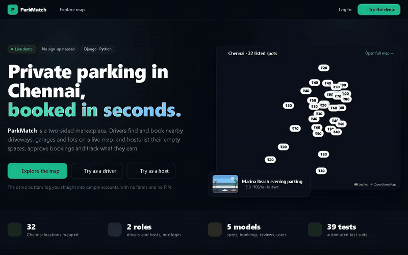

<sub>Driver flow, sped up. [Full-quality video (MP4)](docs/demo/driver-flow.mp4)</sub>

---

## What you can do

**As a driver**
- Search a map of Chennai for spots near you, filter by price, car/bike, covered, CCTV, EV charging, guarded or instant-book, and sort by distance, price or rating.
- Book a time slot and see the price before confirming. Some spots confirm instantly; others need the host's approval.
- Get turn-by-turn directions on the site itself, from your location, a preset like the airport, or any point you tap on the map.
- Keep a digital pass with the booking code, times and the host's number. Cancel before the start time, and leave a review afterwards.

**As a host**
- List a space by dropping a pin on a map and setting a price, slot count and amenities.
- Accept or decline requests, or turn on instant book. Pause a listing at any time.
- Track earnings this month, a 14-day revenue chart, who's parked right now, upcoming guests and your rating.

The demo has two ready-made accounts, and a banner lets you switch between them. Book a spot as the driver, switch to the host and accept it.

## Screenshots

| | |
|---|---|
| 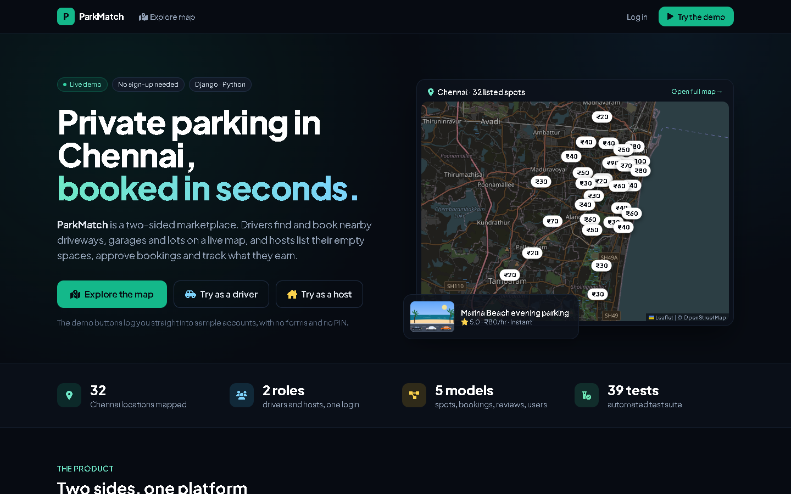 | 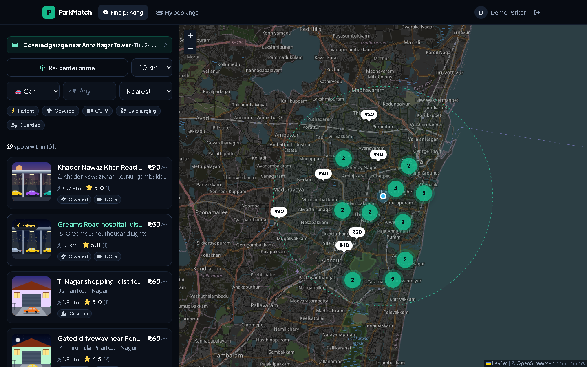 |
| **Landing page.** Live map of every listed spot. | **Search.** Price pins, clustering, radius and filters. |
| 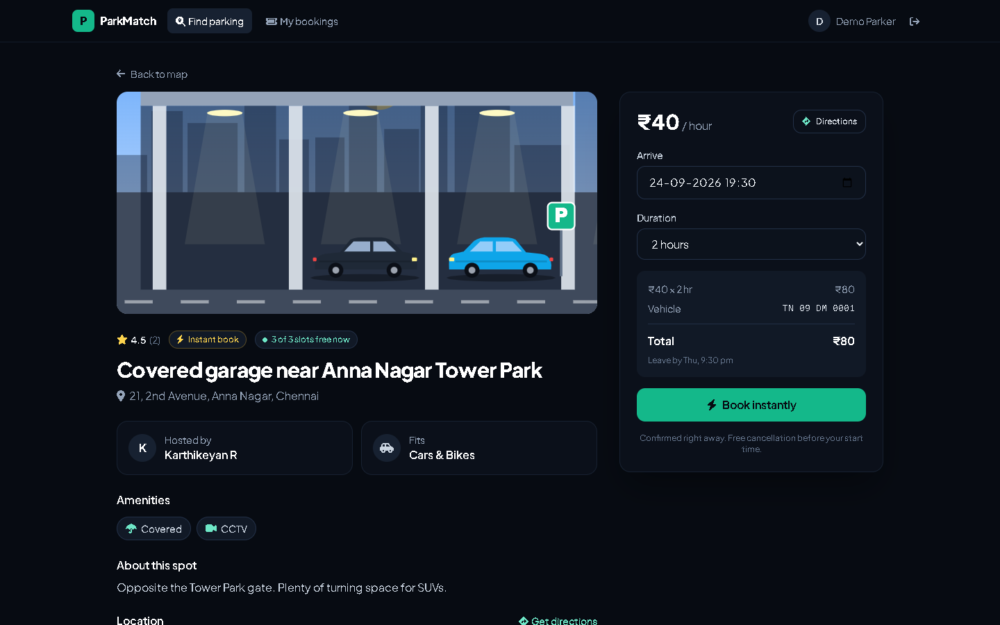 | 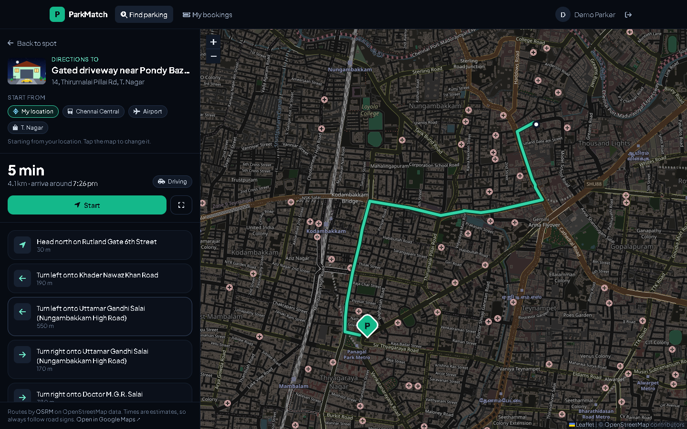 |
| **Spot page.** Live price, availability, reviews. | **Directions.** Route, ETA and turn-by-turn steps. |
| 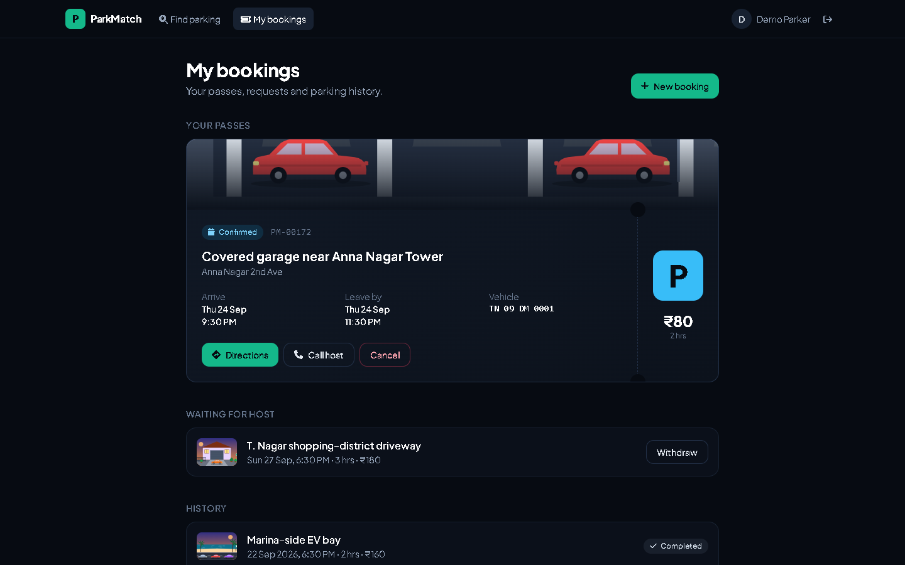 |  |
| **Parking pass.** Booking code, times, host contact. | **Host dashboard.** Requests, earnings, guests. |
| 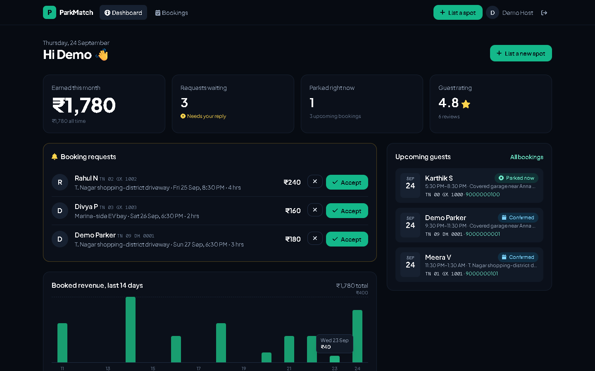 | 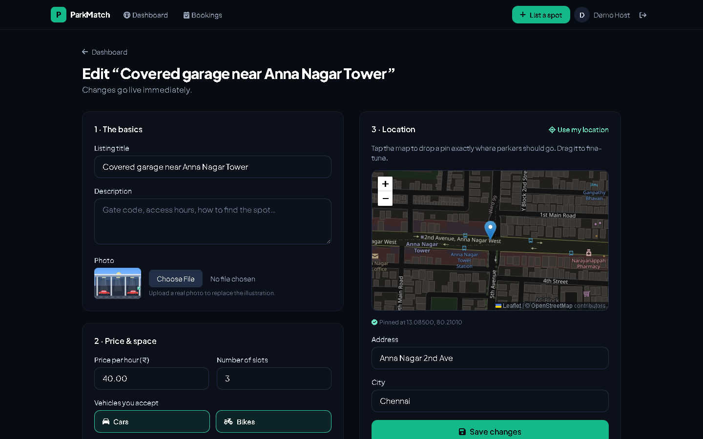 |
| **Earnings.** 14-day revenue with a table view. | **Listing editor.** Pin the exact spot on a map. |

On a phone:

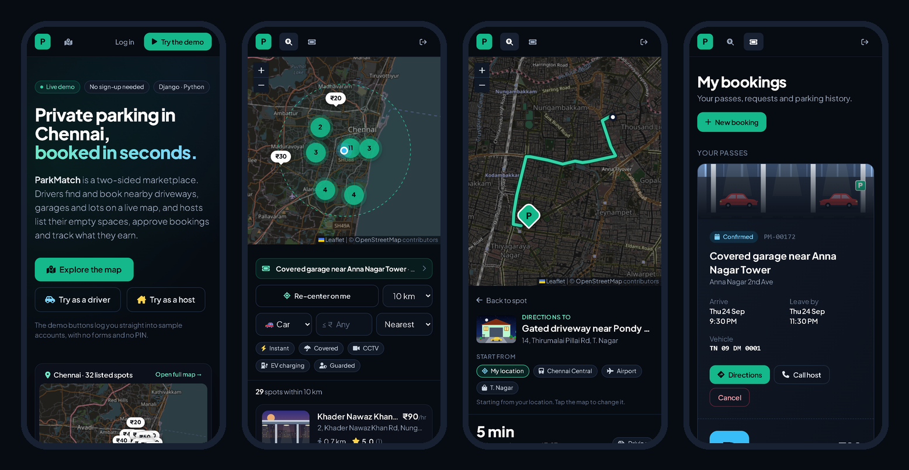

Host side: accepting a request updates the dashboard straight away.

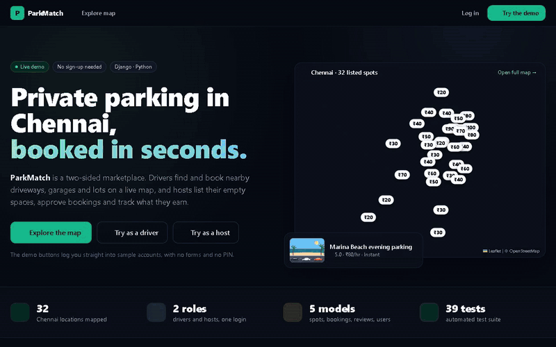

<sub>[Full-quality video (MP4)](docs/demo/host-flow.mp4)</sub>

---

## How it works

### Finding spots nearby
Search is two passes. A bounding box around the search point narrows the candidates in SQL. Then the Haversine distance gives the exact radius, and the results are sorted.

```python
dlat = radius / 111.0                     # ~111 km per degree of latitude
spots = spots.filter(latitude__range=(lat - dlat, lat + dlat),
                     longitude__range=(lon - dlat * 1.2, lon + dlat * 1.2))
results = [s for s in spots if haversine(lat, lon, s.latitude, s.longitude) <= radius]
```

That's plenty for a city's worth of listings. At a much larger scale I'd move this to PostGIS with a spatial index.

### Not double-booking a spot
Each spot has a number of slots. A request is only accepted if the bookings overlapping that time window leave a slot free:

```python
def overlapping(self, start, end):
    return self.bookings.filter(status__in=[PENDING, CONFIRMED], start__lt=end, end__gt=start)
```

The check runs when the driver books, and again inside a transaction when the host accepts, because two requests can both be pending for the last slot. A driver also can't hold two bookings that overlap in time.

### Accounts and security
- Drivers and hosts log in with a phone number and a 4-digit PIN. PINs are hashed with Django's PBKDF2 hasher. Old plain-text PINs from an earlier version are re-hashed the first time the user logs in.
- Five wrong PINs lock that number for five minutes.
- Driver and host sessions are separate roles, enforced by decorators. Every booking and listing lookup is scoped to its owner, so changing an ID in the URL returns a 404.
- CSRF protection on every form, safe `?next=` redirects, and PINs never shown in the admin.

### Directions
The directions page asks [OSRM](https://project-osrm.org/) (open-source routing on OpenStreetMap data) for a route from the browser. It draws the route with Leaflet and turns OSRM's raw manoeuvres (`turn` / `left`, `roundabout` / exit 2 …) into readable steps. In live mode it follows the phone's GPS and highlights the next turn. If the visitor's location is off or they're far from Chennai, it falls back to a sample route instead of showing an error.

### Listing images
Listings without a photo get a generated SVG illustration: a garage, basement, beach, driveway or open lot, picked from the listing's text, with time of day and car colours seeded by the spot's ID. See `parker_main/illustrations.py`.

### Running on Vercel
Vercel's filesystem is read-only and instances are short-lived, so:
- the deploy ships a clean demo database (`deploy/demo.sqlite3`, built by `deploy/build.py`), and each instance copies it to `/tmp` at start-up
- sessions are signed cookies, so a login works whichever instance serves the next request
- the demo data re-seeds itself when its bookings go stale, so there's always something upcoming to look at
- setting `DATABASE_URL` switches to Postgres for permanent data

## Data model

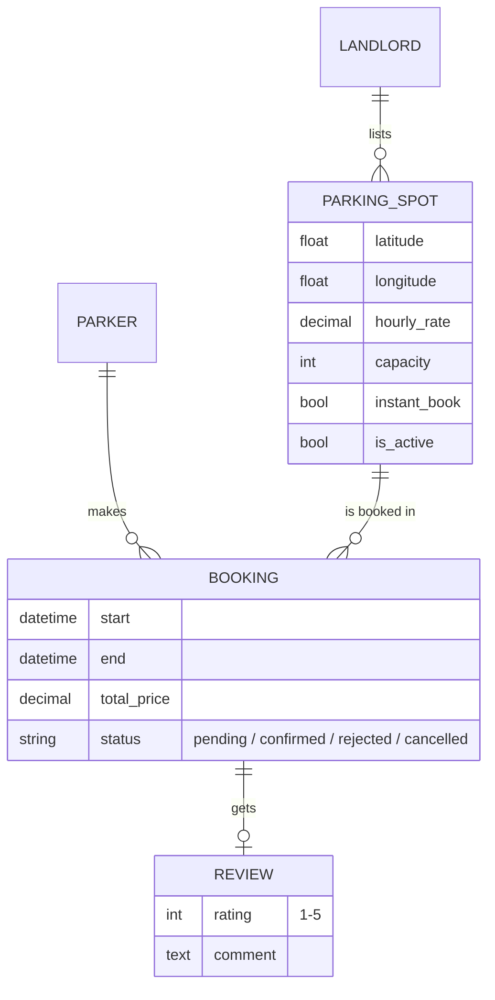

## Tech

| | |
|---|---|
| Backend | Python 3, Django 5.1, Django ORM |
| Database | SQLite locally and on the demo; Postgres via `DATABASE_URL` |
| Front end | Django templates, Tailwind CSS, vanilla JavaScript |
| Maps | Leaflet, OpenStreetMap tiles, Leaflet.markercluster, OSRM routing |
| Hosting | Vercel (Python runtime) with WhiteNoise for static files |
| Tests | Django test runner, 39 tests |

## Running it locally

```bash
git clone <this repo>
cd "ParkMatch Engine"
pip install -r requirements.txt
python manage.py migrate
python manage.py seed_chennai      # 32 spots around Chennai with hosts and reviews
python manage.py seed_demo         # demo driver + demo host
python manage.py runserver
```

Open http://localhost:8000 and click **Try as a driver**. To log in manually, use phone `9000000001` (driver) or `9000000002` (host), with PIN `1234`.

```bash
python manage.py test              # 39 tests
python manage.py seed_demo --reset # put the demo data back after clicking around
```

The test suite covers sign-up and PIN hashing, lockout, role guards, search filters, capacity and overlap checks, instant book, accept and decline, cancellation, reviews, the demo logins and the directions page.

## Deploying

```bash
python deploy/build.py       # clean demo DB + images + static files
npx vercel login
npx vercel deploy --prod
```

Set `DJANGO_SECRET_KEY` in the Vercel project settings (required). Optional: `DATABASE_URL`, and `PARKMATCH_AUTHOR` / `PARKMATCH_REPO_URL` for the footer.

## Project layout

```
Authentication/        users (Parker, Landlord), sign-up, login, lockout, demo accounts
parker_main/           spots, bookings, reviews; search, booking, host tools, directions
  illustrations.py     generated SVG cover art
  management/commands/ seed_chennai, seed_demo, generate_spot_images
templates/             all pages (parker/, landlord/, auth/, partials/)
deploy/build.py        builds the Vercel bundle
docs/                  screenshots and demo videos for this README
```

## Limitations and what I'd do next

- **No payments.** Prices are shown and totals are tracked, but nothing is charged. Next step: Razorpay checkout and payouts to hosts.
- **Notifications.** Hosts see new requests when they open the dashboard. SMS or WhatsApp alerts would make approvals faster.
- **Scale.** The two-pass geo search is fine for thousands of spots. Past that, I'd use PostGIS with a spatial index.
- **Routing.** It uses the public OSRM demo server, which suits a demo but not production traffic. I'd self-host it or use a paid provider.
- **Demo storage.** Without `DATABASE_URL`, bookings made on the live demo reset when Vercel recycles the instance. That's on purpose for a demo.

## Credits

Map data © [OpenStreetMap](https://www.openstreetmap.org/copyright) contributors · routing by [OSRM](https://project-osrm.org/) · maps by [Leaflet](https://leafletjs.com/). The listings, hosts and reviews in the demo are made up.
